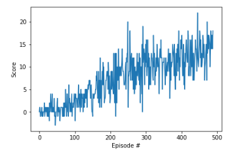

# Report

## Learning algorithm

A Deep Q-Learning network (DQN) with fixed-Q-targets and experience replay is implemented [[1]](https://storage.googleapis.com/deepmind-media/dqn/DQNNaturePaper.pdf).
But instead of the pixel input that is used in the paper, the agent's 37-dimensional state space vector is used as input to the neural network.

### Neural network model architecture
The fully connected neural network takes the state size as input (37) and decompresses it to 128 nodes in the first hidden layer. 
The second hidden layer outputs 64 nodes and the third and final layer has 4 outputs corresponding to the 4 possible actions.

Summarized:
* Layer 1: 37 input - 128 output
* Layer 2: 128 input - 64 output
* Layer 3: 64 input - 4 output

### DQN parameters

An agent produces experience tuples (action, state, reward, next state) with every step in the environment. The DQN stores these in the replay buffer. 
Every 4 time steps a batch size (64) of experiences is sampled from the replay buffer. These experiences are used by the agent to learn. 
The agent learns by minimizing the error between the target and the current Q-Network (fixed-Q-Targets). Finally, the parameters of the current Q-Network are used to build an updated target Q-Network.

* Time steps per episode: 1000
* Epsilon start : 1.0
* Epsilon end: 0.01
* Epsilon decay: 0.995
* Discount factor: 0.99
* Replay buffer size: 1e5
* Batch size: 64
* Timesteps between learning: 4

### Results



```
Episode 100	Average Score: 0.71
Episode 200	Average Score: 4.40
Episode 300	Average Score: 8.88
Episode 400	Average Score: 10.74
Episode 489	Average Score: 13.00
Environment solved in 489 episodes!	Average Score: 13.00
```


### Possible future work

* make the agent learn from pixel input
* use a Double DQN (DDQN)
* incorporate prioritized experience replay
* use a Dueling DQN

